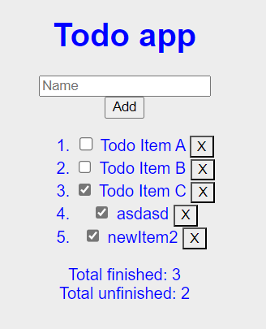

# LitElement JavaScript starter

This project includes a sample component using LitElement with JavaScript.

This template is generated from the `lit-starter-js` package in [the main Lit
repo](https://github.com/lit/lit).



## Setup

Install dependencies:

```bash
npm i
```

## Testing

This sample uses modern-web.dev's
[@web/test-runner](https://www.npmjs.com/package/@web/test-runner) for testing. See the
[modern-web.dev testing documentation](https://modern-web.dev/docs/test-runner/overview) for
more information.

Tests can be run with the `test` script, which will run your tests against Lit's development mode (with more verbose errors) as well as against Lit's production mode:

```bash
npm test
```

## Dev Server

This sample uses modern-web.dev's [@web/dev-server](https://www.npmjs.com/package/@web/dev-server) for previewing the project without additional build steps. Web Dev Server handles resolving Node-style "bare" import specifiers, which aren't supported in browsers. It also automatically transpiles JavaScript and adds polyfills to support older browsers.

To run the dev server and open the project in a new browser tab:

```bash
npm run serve
```

The site will usually be served at http://localhost:8000.
